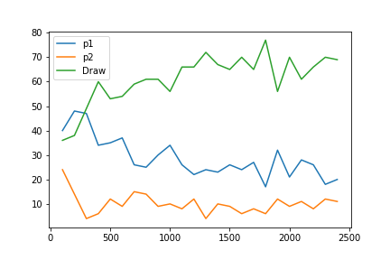
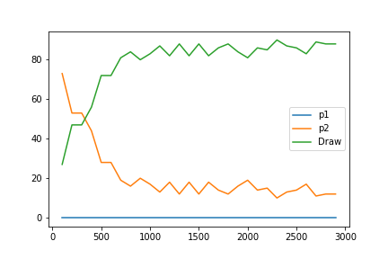
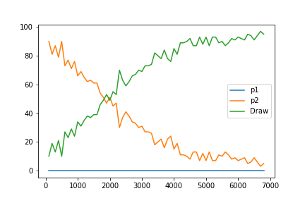
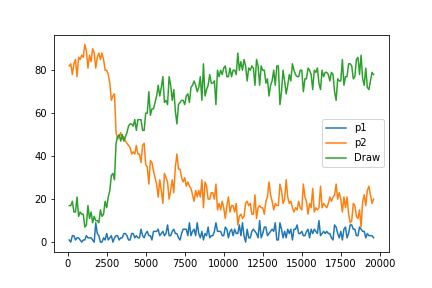
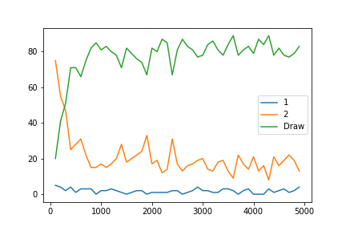
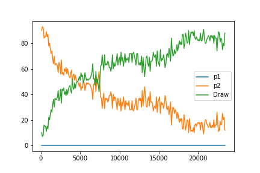
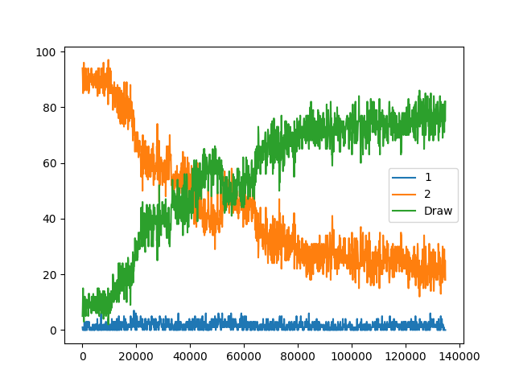
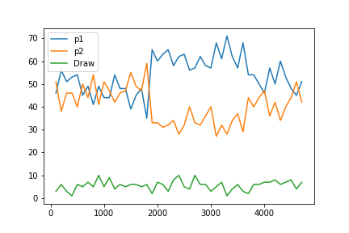

# Training Aritificial Neural Networks to play Connect 4

This repository contains implementation of multiple Deep Reinforcement Learning algorithms using which an Artificial Neural Net(ANN) is trained to play board games like Connect4 and Tic-Tac-Toe. Since, these algorithms are very general, they can be applied in many areas to solve a lot more challenging problems as well.

Another purpose of this repository is to get a good intuition of how different reinforcement learning algorithms work, what are their pros and cons, and how do they differ from each other. Hence, to support experimentation and given how machine learning is all about tweaking the hyper-parameters, a general framework is implemented with every module being highly customisable.

## How it works
In general how the code works is you take 2 player objects, 1 environment object and run the environment. Player objects come with their default brains which are essentially the underlying algorithms. However, you can make a custom brain object and assign it to a player which will override its default brain. See and run examples for more info. Note: The working directory should be set as the src folder of this repo.

## How to run
- Set the src folder of this repository as the working directory.

  `export PYTHONPATH=$PYTHONPATH:src`
- Run one of the examples. For example, DDQN Tic Tac Toe player against minimax.

  `python3 examples/T3-DDQNvsMinimax.py`

## Implemented Algorithms
Two main classes of Reinforcement Learning i.e. Q-Network and Policy Gradient, plus fairly new self learning algorithm described in AlphaGo Zero paper.
- Deep Q-Network(DQN), just like described in "Playing Atari" papers with Prioritised Experience Replay, reward and error clipping, and a separate target network aka Double DQN. By changing the neural net architecture, even Duelling DQN can also be made. For more information on DQNs, I suggest this amazing [series](https://jaromiru.com/) of blog posts. A few code snippets were directly taken from there.
- Policy Gradient(PG), Asynchronous Advantageous Actor-Critic aka A3C
- Asynchronous DQN
- Possible other variations as described by "[Rainbow](https://arxiv.org/pdf/1710.02298.pdf)" paper can be implemented just by tweaking the code a bit.
- AlphaZero self learning algorithm implemented down to every detail as described in the methods section of the paper.

## Features
- An ANN backed up model could be matched against a perfect playing MiniMax player and learn from it using DQN, PG or their other variants.
- An ANN backed up model could learn from self playing with the help of AlphaZero or DQN.

## Players
Every player must implement 'act', 'observe' and 'train' methods of the abstract base class "Player" as these methods would be called by the environment.
- DQN
- PG
- AlphaZero
- MiniMax players for Connect4 and Tic-Tac-Toe with customisable board size. For Connect4 MiniMax agent on a different board size one must compile one of these repositories [[1]](https://github.com/kirarpit/connect4-minimax), [[2]](https://github.com/MarkusThill/Connect-Four) from source, run them in the background and query them live. Feel free to raise an issue in case you need help with that. For the regular board size, the code will hit an API server which runs the first  repository code mentioned here.
- Human player for playing against trained networks.

## Results
- Below are some of the charts showing total wins for player 1(p1), player 2(p2) and draws after x games.
- Post training all the models shown below for TicTacToe and Connect4 on a smaller board size of 4X5 were able to defeat a corresponding perfect playing Minimax player - with 5% chance of making a random move each turn - in 95% of the games.

|   |  |
|:---:|:---:|
| AlphaZero Player self learning TicTacToe | Async DQN Player vs Minimax on TicTacToe |

|   |  |
|:---:|:---:|
| Double DQN Player vs Minimax on TicTacToe | Policy Gradient Player vs Minimax on TicTacToe |

|   |  |
|:---:|:---:|
| Async DQN Player vs Minimax on Connect4(Board size 4X5) | Double DQN Player vs Minimax on Connect4(Board size 4X5) |

|  |  |
|:---:|:---:|
| Policy Gradient Player vs Minimax on Connect4(Board size 4X5) | AlphaZero Player self learning Connect4(Board size 6X7) |

## Observations
- Exploration plays a very crucial role in learning. I highly recommend reading this [paper](https://arxiv.org/abs/1507.00814) on incentivising exploration. Although due to time constraint I was not able to implement it but it seems promising.
- Getting rewards time to time is highly important. Sparse rewards in such board games where you only receive the reward at the end, make it a lot more difficult to learn. One of the remedies is the N_STEP solution. Check PG and Q Players for more info.
- Convolutional networks do perform better majorly because they exploit the spatial representation of the pixels and hence can identify patterns easily.
- DQN can learn from others experiences as well since it does offline learning compared to PG which does online. But PG shows better results since it optimises directly on the policy. Plus a network with multiple outputs as Value and Policy is advantageous and help achieve better proficiency.
- DQN converges faster than PG but PG is more robust to stochastic environments.
- Asynchronous DQN is most data efficient because of the obvious reason that a lot more training is going on with every step.
- Asynchronous algos work a lot better with workers having different exploration rates.
- AlphaZero is definitely a much superior algorithm and generates much better models which outperform other models generated by other mentioned algos. But it's less general and depends on perfect information assumption.

# Conclusion
Although, the initial goal was to just solve Connect4 in an unsupervised fashion but since I was experimenting with different algorithms I ended up implementing a basic framework for Reinforcement Learning algorithms. Feel free to fork, create an issue or make a pull request.
